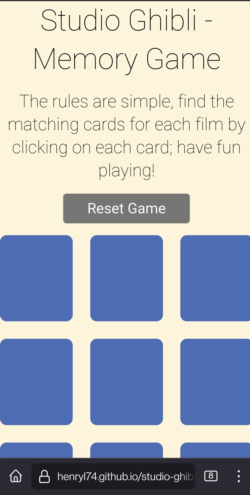

# Portfolio Project 2 - Studio Ghibli Memory Game

The classic memory game is a common children's game played with a set of cards. The cards have a picture on one side and each picture appears on two cards. The game starts with all the cards face down and the players take turns to turn over two cards. If the two cards have the same picture, then they keep the cards, otherwise they turn the cards face down again. The winner is the person with the most cards when all the cards have been taken.

In this web version the rules are practically the same, however only one person can play at the time; and the palyer doesn't get to keep the cards :)

The main goal of this project is to demonstrate my knowledge acquired throughout the course in HTML, CSS, and primerely focusing on JavaScript.

---

## Live Site
[Studio Ghibli - Memory Game](https://henryl74.github.io/studio-ghibli-memory-game/)

---
# Features

My project consists of one main webpage with the following features:

- Welcome message
- Header
- Paragraph
- A reset game button
- Sixteen cards for the game

### - Welcome Message

- This feature is displayed when the user access for first time to the site, and when the game has been reset.
- The message is intended to welcome the user and explains what to do when the game has finished.

### - The Header

- Featured at the top center of the page, the header dispays the game name: Studio Ghibli - Memory Game in a nice simple font and clearly contrast with the background. 
- The header clearly indicates the user the type of game is about about to play and the subject theme.

### - The Paragraph

- Featured below the header, the paragraph main purpose is to explain the main rule of the game to the payer.

### - Reset Game Button

- This option allows the player to reset the game to the beginning so it can be played again.
- The button has been nicely styled, change colors when hover and clicked, making this option more enjoyable and interactive.

### - Sixteen Cards for the Game

- The cards have been distributed in a nice grid of 4 cards by column by 4 by row.
- Each card has been nicely styled, I implemented a small animation when is hovered with the mouse.
- Each card changes to different matching colours when clicked, this feature makes the game more enjoyable, nice to first view and interactive.
- The game results are clear to the user, for each card matched the card will freeze and stay up displaying the image of the film, making the game easy to play.

---
## Features Left to Implement

- Due to time constraints I could not implement a timer, and two different levels of difficulty; these features will be taken into consideration for the future.

# Testing
---

- I tested playing this game in different web browsers such as: Chrome, Firefox, Safari on desktop and mobile phones respectively.
- I confirmed thatthe game results are always correct.
- I confirmed that the welcome message, header, paragraph, reset button, are all readable and easy to understand.
- I confirmed that this project is responsive, looks good and functions on all standard screen sizes using the DevTools device toolbar.

### Google Chrome Browser

### Safari Browser

### Firefox Mobile Browser

