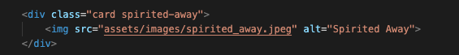

# Portfolio Project 2 - Studio Ghibli Memory Game

The classic memory game is a common children's game played with a set of cards. The cards have a picture on one side and each picture appears on two cards. The game starts with all the cards face down and the players take turns to turn over two cards. If the two cards have the same picture, then they keep the cards, otherwise they turn the cards face down again. The winner is the person with the most cards when all the cards have been taken.

In this web version the rules are practically the same, however only one person can play at the time; and the palyer doesn't get to keep the cards :)

The main goal of this project is to demonstrate my knowledge acquired throughout the course in HTML, CSS, and primerely focusing on JavaScript.

---

## Live Site
[Studio Ghibli - Memory Game](https://henryl74.github.io/studio-ghibli-memory-game/)

---
# Features

My project consists of one main webpage with the following features:

- Welcome message
- Header
- Paragraph
- A reset game button
- Sixteen cards for the game

### - Welcome Message

- This feature is displayed when the user access for first time to the site, and when the game has been reset.
- The message is intended to welcome the user and explains what to do when the game has finished.

### - The Header

- Featured at the top center of the page, the header dispays the game name: Studio Ghibli - Memory Game in a nice simple font and clearly contrast with the background. 
- The header clearly indicates the user the type of game is about about to play and the subject theme.

### - The Paragraph

- Featured below the header, the paragraph main purpose is to explain the main rule of the game to the player.

### - Reset Game Button

- This option allows the player to reset the game to the beginning so it can be played again.
- The button has been nicely styled, it change colors when hover and clicked, making this option more enjoyable and interactive.

### - Sixteen Cards for the Game

- The cards have been distributed in a nice grid of 4 cards by column by 4 by row.
- Each card has been nicely styled, I implemented a small animation when is hovered with the mouse.
- Each card changes to different matching colours when clicked, this feature makes the game more enjoyable, nice to first view and interactive.
- The game results are clear to the user, for each card matched the card will freeze and stay up displaying the image of the film, making the game easy to play.

---
## Features Left to Implement

- Due to time constraints I could not implement a timer, and two different levels of difficulty; these features will be taken into consideration for the future.

# Testing
---

- I tested playing this game in different web browsers such as: Chrome, Firefox, Safari on desktop and mobile phones respectively.
- I confirmed that the game results are always correct.
- I confirmed that the welcome message, header, paragraph, reset button, are all readable and easy to understand.
- I confirmed that this project is responsive, looks good and functions on all standard screen sizes using the DevTools device toolbar.
- Due to time constraints I could not test the site for all type of mobile phones, the site works very well in most mobile standard devices, laptops and desktop computer.

### Google Chrome Browser

### Safari Browser

### Firefox Mobile Browser

# Bugs

### Solved bugs

- While testing my html code in W3C, I noticed there was a problem with my div due a duplicate ID for each duplicate card created for the game.

- I solved this by eliminating the ID from the div, then proceeded to add the value of the ID to the existing class attribute of my div as per the below example:

- Media queries for small devices, the grid was not fitting well for screens under 400px. I solved this by making grid-template-columns repeat to 3 instead of 4.

### Unfixed Bugs

- There are not unfixed bugs left for this game, as far I could check.

# Validator Testing
---

## HTML

- The first time I run the html in W3C, it returned with a few errors encountered in my divs due duplicate IDs encountered in the duplicate cards of my html file, I fixed this as per the solved bugs explenation; run the html files again and this time no errors were returned when passing through the official W3C validator.

## CSS

- No errors were found when passing through the official (Jigsaw) validator.

## JavaScript

- No errors were found when passing through the official JSHint JavaScript Validator

### Accessibility

- I confirmed that the colors and fonts chosen are easy to read and accessible by running lighthouse in DevTools.

### Desktop

### Mobile

- The performance score is a little bit lower than expected, this is due the size of the images I used in the game; still this does not affect the accessibility and game performance on mobile devices.

### Deployment

The site was deployed to GitHub pages. The steps I followed are:

- In the GitHub repository, I navigate to the Settings tab.
- Under General I selected the GitHub Pages section, clicked on the pages settings dedicated tab link.
- From the source section drop-down menu, I selected the Main Branch then clicked on save.
- Once the Main Branch has been selected and saved, the page will be automatically refreshed and provide the link to the published website.

The live link can be found here: [Studio Ghibli - Memory Game](https://henryl74.github.io/studio-ghibli-memory-game/)

# Credits

## Content

- The idea for the layout of the game came from the Code Institute Love Maths module. I had no previous experience building a game using JavaScript; and doing this project before anything was a huge help, thank you Code Institute.
- Additional inspiration came from the porffolio project scope module about building a game called Rock Paper Scissors as well.
- I checked for all kind of reference from previous projects about quizzes and games posted in slack channel.
- W3 schools tutorial about how How TO - Flip Card [W3 schools](https://www.w3schools.com/howto/howto_css_flip_card.asp)
- Intro to CSS 3D transforms - Card Flip [Intro to CSS 3D transforms](https://3dtransforms.desandro.com/card-flip)
- Maria del Carmen Santiago - Multi-faced Flip Card with a Click (Part 3: JavaScript) [Maria del Carmen Santiago](https://dev.to/santiagocodes/multi-faced-flip-card-with-a-click-part-3-javascript-2f7f)
- Build 30 things with vanilla JS in 30 days with 30 tutorials [JavaScript 30](https://javascript30.com/)
- A big thank you to my little daughter for inspiring me to do this game, and for giving me the main subject idea from Studio Ghibli; we both love these books and films.

## Media

- The images used for the game have been made available to fans free of charge from Studio Ghibli official website [Studio Ghibli](https://www.ghibli.jp/info/013344/)
- Favicon image attributed to Freepik [Freepik](https://www.flaticon.com/packs/origami-28)

## Acknowledgements

- The README template provided y Code Institute on the full sample README from "Portfolio Project Scope".
- The online tutors for all their help.
- The Code Institute slack community.
- Stack Overflow question and answer website.
- My classmates: Tasha Johnson and Usman Khan for their constant support and encouragement.
- My new mentor Chris Quinn, big thank you for all your positive feedback and guidance given. 
- Last but not least Code Institute student support team, for listening to my concerns and support given.
---

